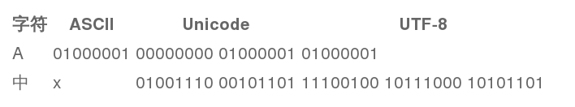

# Python 脚本编程及系统大规模自动化运维-python简介
<!-- TOC depthFrom:1 depthTo:6 withLinks:1 updateOnSave:1 orderedList:0 -->

- [Python 脚本编程及系统大规模自动化运维-python简介](#python-脚本编程及系统大规模自动化运维-python简介)
	- [拓展阅读](#拓展阅读)
	- [学习的框架](#学习的框架)
	- [Python简介](#python简介)
		- [编译型语言和解释型语言的区别](#编译型语言和解释型语言的区别)
		- [当前使用python编写程序](#当前使用python编写程序)
		- [python的历史](#python的历史)
		- [python的版本](#python的版本)
		- [python的中心哲学](#python的中心哲学)
	- [一些基础知识](#一些基础知识)
		- [在bash和python中执行命令的对比](#在bash和python中执行命令的对比)
		- [在python中执行命令](#在python中执行命令)
		- [写一个python脚本显示系统信息](#写一个python脚本显示系统信息)
		- [初学者可以使用ipython工具来使用](#初学者可以使用ipython工具来使用)
		- [在Python中使用函数](#在python中使用函数)
		- [课堂练习](#课堂练习)
			- [将sysinfo.py转变成函数:sysinfo_func.py](#将sysinfopy转变成函数sysinfofuncpy)
			- [将sysinfo.sh转变成函数:sysinfo_func.sh](#将sysinfosh转变成函数sysinfofuncsh)
			- [修改python和bash代码中的系统调用程序，将其变成自己的内容。](#修改python和bash代码中的系统调用程序将其变成自己的内容)
			- [在python中import加载之前写的sysinfo.py](#在python中import加载之前写的sysinfopy)
			- [在python中import加载修改过的sysinfo_func.py，修改内容如下：](#在python中import加载修改过的sysinfofuncpy修改内容如下)
		- [__name__属性](#name属性)
	- [ipython](#ipython)
		- [ipython简介](#ipython简介)
		- [ipython的特性](#ipython的特性)
	- [变量](#变量)
		- [变量的定义](#变量的定义)
		- [变量的命名规则](#变量的命名规则)
		- [变量的分类](#变量的分类)
	- [数字](#数字)
		- [math模块](#math模块)
			- [random模块](#random模块)
	- [文本](#文本)
		- [Python的内建功能及模块](#python的内建功能及模块)
			- [str字符串](#str字符串)
			- [创建字符串](#创建字符串)
			- [数据提取](#数据提取)
				- [判断字符串的包含关系in|not](#判断字符串的包含关系innot)
				- [子字符串具体位置find()|index()](#子字符串具体位置findindex)
				- [字符串切分](#字符串切分)
				- [判断字符串的开始和结束字符](#判断字符串的开始和结束字符)
				- [删除空白](#删除空白)
				- [删除字符](#删除字符)
				- [字符大小写转换](#字符大小写转换)
				- [按照分割符提取字符串](#按照分割符提取字符串)
				- [提取行](#提取行)
				- [将数字转化成字符串](#将数字转化成字符串)
				- [将字符串转化成数字](#将字符串转化成数字)
				- [连接字符串](#连接字符串)
				- [Unicode字符串](#unicode字符串)
				- [re](#re)
			- [print](#print)
			- [格式化字符串](#格式化字符串)
		- [文件处理file类](#文件处理file类)
			- [读取文件](#读取文件)
			- [写文件](#写文件)
			- [额外资源](#额外资源)
			- [标准输入与输出](#标准输入与输出)
			- [StingIO](#stingio)
			- [urllib](#urllib)
	- [课后习题](#课后习题)
		- [安装ipython](#安装ipython)
		- [数字](#数字)
		- [字符串](#字符串)
		- [文本](#文本)

<!-- /TOC -->

## 拓展阅读

* python官方文档	http://wiki.woodpecker.org.cn/moin/March_Liu/PyTutorial
* 基础入门：《A byte of Python》
* 查阅字典：《python学习手册》
* 开发型运维：《python+Unix和Linux系统管理指南》《python自动化运维》

## 学习的框架
```Shell
1）python简介
2）ipython的安装使用
3）数据类型
	数字
	字符串
	文件
	列表
	元组
	字典
	集合
4）流程控制语句
	if
	for
	while
	break\continue\pass
	range
5）函数
6）模块
7) 类class
8) 虚拟环境搭建和第三方包的安装
9) 综合实例
```

## Python简介

python是简单的、免费的（BSD）、面向对象的、可读性非常强、交互式的解释型语言

### 编译型语言和解释型语言的区别

* 编译型语言：c c++ java
* 解释型语言：bash python

* 编译的过程 c语言--------》机器语言 二进制0 1
* 解释的过程 bash--》字符码（中间过程）====》机器语言

速度：编译型语言快

### 当前使用python编写程序

*	yum
* gedit
*	youtube
*	NASA
*	豆瓣

### python的历史

作者：Guido van Rossum

首次发行时间：1991

版本系列：2.7 / 3.5

分类：强类型动态语言

支持系统：几乎全部


Python 语言是少有的一种可以称得上即简单又功能强大的编程语言。你将惊喜地
发现 Python 语言是多么地简单,它注重的是如何解决问题而不是编程语言的语法和
结构。

Python 语言的官方介绍是:

Python 是一种简单易学,功能强大的编程语言,它有高效率的高层数据结构,简
单而有效地实现面向对象编程。 Python 简洁的语法和对动态输入的支持,再加
上解释性语言的本质,使得它在大多数平台上的许多领域都是一个理想的脚本语
言,特别适用于快速的应用程序开发。

### python的版本

版本系列：2.7 / 3.5

rhel7 2.7.5

一般高版本兼容低版本

但是python的高版本不一定兼容低版本

### python的中心哲学
```shell
>>> import this
The Zen of Python, by Tim Peters

Beautiful is better than ugly.
Explicit is better than implicit.
Simple is better than complex.
Complex is better than complicated.
Flat is better than nested.
Sparse is better than dense.
Readability counts.
Special cases aren't special enough to break the rules.
Although practicality beats purity.
Errors should never pass silently.
Unless explicitly silenced.
In the face of ambiguity, refuse the temptation to guess.
There should be one-- and preferably only one --obvious way to do it.
Although that way may not be obvious at first unless you're Dutch.
Now is better than never.
Although never is often better than *right* now.
If the implementation is hard to explain, it's a bad idea.
If the implementation is easy to explain, it may be a good idea.
Namespaces are one honking great idea -- let's do more of those!
```

## 一些基础知识

交互式shell：
* bash
* python
---
### 在bash和python中执行命令的对比

下面的例子其实看不出区别多大，但是我们能看到不同的shell做同样一件事情，使用的命令并不相同。

```shell
[root@workstation0 ~]# echo "hello"
hello
------------------------------------
>>> print "hello"
hello
```

### 在python中执行命令

在bash中执行`ls -l /tmp`,那么在python中该如何操作呢？
```shell
>>> import subprocess
>>> subprocess.call(['ls','-l','/tmp'])
total 16
-rw-r--r--. 1 root root 271 Oct 18 11:49 f1.py
drwx------. 3 root root  16 Oct 18 10:26 systemd-private-e67cf4721d8a406485ba836c215f04aa-colord.service-elJaMh
drwx------. 3 root root  16 Oct 18 10:26 systemd-private-e67cf4721d8a406485ba836c215f04aa-cups.service-Pj9mNR
drwx------. 3 root root  16 Oct 18 10:26 systemd-private-e67cf4721d8a406485ba836c215f04aa-rtkit-daemon.service-wTmvkM
drwx------. 3 root root  16 Oct 19 10:18 systemd-private-f1d37d63f6684cafa2e6d7f420dacffe-colord.service-iMUb3u
drwx------. 3 root root  16 Oct 19 10:18 systemd-private-f1d37d63f6684cafa2e6d7f420dacffe-cups.service-sEomwX
drwx------. 3 root root  16 Oct 19 10:18 systemd-private-f1d37d63f6684cafa2e6d7f420dacffe-rtkit-daemon.service-9bGrzQ
-rw-r--r--. 1 root root 106 Oct 17 16:38 test.py
-rw-r--r--. 1 root root 109 Oct 17 16:53 useradd.py
-rw-r--r--. 1 root root  74 Oct 17 16:52 userlist
0
```

bash使用非常简单的`ls -l`就能达到目的，而python需要去加载模块`subporcess`才能达到目的；有点类似于bash中的`source`
这个示例可以看出在系统编程中如何使用pyhton的通用思路。

### 写一个python脚本显示系统信息

```shell
[root@workstation0 ~]# cat sysinfo.py
#!/usr/bin/env python
# encoding=utf-8
#A System Information Gathering Script
import subprocess

#Command 1
uname = "uname"
uname_arg = "-a"
print("系统信息 Gathering system information with %s command:\n" %uname)
subprocess.call([uname,uname_arg])

#Command 2
diskspace = "df"
diskspace_arg = "-h"
print("磁盘空间 Gathering diskspace information %s command:\n" % diskspace)
subprocess.call([diskspace,diskspace_arg])


[root@workstation0 ~]# python sysinfo.py
系统信息 Gathering system information with uname command:

Linux workstation0.example.com 3.10.0-327.el7.x86_64 #1 SMP Thu Oct 29 17:29:29 EDT 2015 x86_64 x86_64 x86_64 GNU/Linux
磁盘空间 Gathering diskspace information df command:

Filesystem      Size  Used Avail Use% Mounted on
/dev/vda2        20G  3.0G   17G  15% /
devtmpfs        483M     0  483M   0% /dev
tmpfs           497M   84K  497M   1% /dev/shm
tmpfs           497M  6.9M  490M   2% /run
tmpfs           497M     0  497M   0% /sys/fs/cgroup
/dev/vda1       197M  125M   73M  64% /boot
tmpfs           100M   16K  100M   1% /run/user/42
tmpfs           100M     0  100M   0% /run/user/0
```

对比bash的写法

```bash
[root@workstation0 ~]# cat sysinfo.bash
#!/bin/bash
echo "系统信息 Gathering system information with uname command:"
uanme -r
echo "磁盘信息 Gathering system information with df command:"
df -h
[root@workstation0 ~]# bash sysinfo.bash
系统信息 Gathering system information with uname command:
sysinfo.bash: line 3: uanme: command not found
磁盘信息 Gathering system information with df command:
Filesystem      Size  Used Avail Use% Mounted on
/dev/vda2        20G  3.0G   17G  15% /
devtmpfs        483M     0  483M   0% /dev
tmpfs           497M   84K  497M   1% /dev/shm
tmpfs           497M  6.9M  490M   2% /run
tmpfs           497M     0  497M   0% /sys/fs/cgroup
/dev/vda1       197M  125M   73M  64% /boot
tmpfs           100M   16K  100M   1% /run/user/42
tmpfs           100M     0  100M   0% /run/user/0
```

对比bash脚本和python脚本，我们发现他们非常相似，而结果是一摸一样的。
需要注意的是，在subproce.call中将命令与参数完全分开的写法只是一种，还可以像下面一样：

subprocess.call("df -h",shell=True)

subprocess模块包含了使用python实现系统调用的代码。
我们除了使用系统的模块，还可以自己创建自己的模块或文件，供以后使用。


### 初学者可以使用ipython工具来使用

ipython有一些特性，比如能够使用tab键补全，可以使用?来获取帮助
ipython中可以使用help()来获取帮助

---
问自己几个问题：
* 如何编写一个简单的python脚本
* 如何将bash脚本翻译成python脚本并执行它
* 如何查询不熟悉的模块或属性的文档
* 如何将一系列连续的命令组织到函数中


### 在Python中使用函数

bash脚本和python脚本：将命令放在文本中一条接一条地连续执行多个命令
手工==>自动完成

* 函数：代码块--每一行代码属于该函数--可以被调用
* 脚本与函数：脚本中可以包含多个函数
---

* bash定义函数：{}
* python定义行数：嵌套代码-统一的缩进（tab或四个空格）

```python
>>> def pyfunc():
...     print("hello function")
...
>>> pyfunc()
hello function
>>> for i in range(4):
...     pyfunc()
...
hello function
hello function
hello function
hello function
```

我们再使用bash完成以上功能

```bash
[root@workstation0 ~]# shfunc()
> {
>     echo "hello function"
> }
[root@workstation0 ~]# for i in `seq 1 4`
> do
>     shfunc
> done
hello function
hello function
hello function
hello function
```

我们发现bash和python在函数定义上语法不同，for循环语法也不同
但是能看到python更简洁。

### 课堂练习

#### 将sysinfo.py转变成函数:sysinfo_func.py

```shell
[root@workstation0 ~]# cat sysinfo_func.py
#!/usr/bin/env python
# encoding=utf-8
#A System Information Gathering Script
import subprocess

#Command 1
def uname_func():
	uname = "uname"
	uname_arg = "-a"
	print("系统信息 Gathering system information with %s command:\n" %uname)
	subprocess.call([uname,uname_arg])

#Command 2
def disk_func():
	diskspace = "df"
	diskspace_arg = "-h"
	print("磁盘空间 Gathering diskspace information %s command:\n" % diskspace)
	subprocess.call([diskspace,diskspace_arg])

#Main function that call other functions
def main():
	uname_func()
	disk_func()

main()
```

#### 将sysinfo.sh转变成函数:sysinfo_func.sh

对比sysinfo_func.sh和sysinfo_func.py，可以看python和bash有很多
相似之处。

到目前为止，我们已经是一名能够使用bash或python编写简单函数的程序员了。
作为程序员，编写程序的过程就是学习的过程。

#### 修改python和bash代码中的系统调用程序，将其变成自己的内容。

可以去尝试实现以下功能：
*	1）查看系统发行版本`cat /etc/redhat-release`
*	2）查看系统内核版本`uname -r`
*	3）查看系统磁盘信息`df -h`
*	4）查看当前系统用户`who`
*	5）查看系统运行时间`uptime`
*	6）查看selinux的状态`getenforce`
* 	7）查看内存信息`free -h`
*	8）查看网络状况`ifconfig`

#### 在python中import加载之前写的sysinfo.py
```python
>>> import sysinfo
系统信息 Gathering system information with uname command:

Linux workstation0.example.com 3.10.0-327.el7.x86_64 #1 SMP Thu Oct 29 17:29:29 EDT 2015 x86_64 x86_64 x86_64 GNU/Linux
磁盘空间 Gathering diskspace information df command:

Filesystem      Size  Used Avail Use% Mounted on
/dev/vda2        20G  3.0G   17G  15% /
devtmpfs        483M     0  483M   0% /dev
tmpfs           497M   84K  497M   1% /dev/shm
tmpfs           497M  6.9M  490M   2% /run
tmpfs           497M     0  497M   0% /sys/fs/cgroup
/dev/vda1       197M  125M   73M  64% /boot
tmpfs           100M   16K  100M   1% /run/user/42
tmpfs           100M     0  100M   0% /run/user/0
```
在python中一个模块对应一个文件，反过来，一个文件对应一个模块，
我们将脚本文件载入到python中，加载的时候，不用带.py,加了反而会失败。

#### 在python中import加载修改过的sysinfo_func.py，修改内容如下：
```shell
#main()
if __name__=="__main__":
        main()
```

```shell
[root@workstation0 ~]# python
Python 2.7.5 (default, Oct 11 2015, 17:47:16)
[GCC 4.8.3 20140911 (Red Hat 4.8.3-9)] on linux2
Type "help", "copyright", "credits" or "license" for more information.
>>> import sysinfo_func
>>> sysinfo_func.disk_func()
磁盘空间 Gathering diskspace information df command:

Filesystem      Size  Used Avail Use% Mounted on
/dev/vda2        20G  3.0G   17G  15% /
devtmpfs        483M     0  483M   0% /dev
tmpfs           497M   84K  497M   1% /dev/shm
tmpfs           497M  6.9M  490M   2% /run
tmpfs           497M     0  497M   0% /sys/fs/cgroup
/dev/vda1       197M  125M   73M  64% /boot
tmpfs           100M   16K  100M   1% /run/user/42
tmpfs           100M     0  100M   0% /run/user/0
>>> sysinfo_func.main()
系统信息 Gathering system information with uname command:

Linux workstation0.example.com 3.10.0-327.el7.x86_64 #1 SMP Thu Oct 29 17:29:29 EDT 2015 x86_64 x86_64 x86_64 GNU/Linux
磁盘空间 Gathering diskspace information df command:

Filesystem      Size  Used Avail Use% Mounted on
/dev/vda2        20G  3.0G   17G  15% /
devtmpfs        483M     0  483M   0% /dev
tmpfs           497M   84K  497M   1% /dev/shm
tmpfs           497M  6.9M  490M   2% /run
tmpfs           497M     0  497M   0% /sys/fs/cgroup
/dev/vda1       197M  125M   73M  64% /boot
tmpfs           100M   16K  100M   1% /run/user/42
tmpfs           100M     0  100M   0% /run/user/0

>>> help(sysinfo_func)

Help on module sysinfo_func:

NAME
    sysinfo_func

FILE
    /root/sysinfo_func.py

DESCRIPTION
    # encoding=utf-8
    #A System Information Gathering Script

FUNCTIONS
    disk_func()
        #Command 2

    main()
        #Main function that call other functions

    uname_func()
        #Command 1

(END)
>>> dir(sysinfo_func)
['__builtins__', '__doc__', '__file__', '__name__', '__package__', 'disk_func', 'main', 'subprocess', 'uname_func']
```

* 编写重用模块的目的：将来在新的脚本中可以重复使用


### __name__属性

当__name__等于'__main__'时，说明当前模块被作为脚本运行。不生成pyc文件（因为不是import）。

```shell
[root@workstation0 ~]# ll
total 20
-rw-r--r--. 1 root root 162 Oct 19 12:21 sysinfo.bash
-rw-r--r--. 1 root root 592 Oct 19 14:44 sysinfo_func.py
-rw-r--r--. 1 root root 819 Oct 19 14:38 sysinfo_func.pyc
-rw-r--r--. 1 root root 429 Oct 19 12:11 sysinfo.py
-rw-r--r--. 1 root root 442 Oct 19 14:10 sysinfo.pyc
```

pyc是import时被编译过的py文件，加载pyc文件可以跳过语法解析过程。
如果py比pyc新，那么重新生成pyc；Python3通过__pycache__目录来缓存pyc文件。（避免多个Python解释器无法互相载入对方的pyc文件。）

---

## ipython

ipython是工具包中最常使用的一个工具。掌握了这个神奇的shell，就相当于掌握了一个神奇的文本编辑器。越精通他就可以越快速地完成单调乏味的工作。

### ipython简介

1. ipython	集成了交互式python的诸多优点，性能高于标准的python
2. 社区 http://lists.ipython.scipy.org/mailman/listinfo/ipython-user
3. wiki http://ipython.scipy.org/moin
4. ipython名人	Fernando Perez\Ville Vainio
5. 安装ipython	http://ipython.scipy.org/dist
		源码安装	python setup.py install
		rpm包	yum install -y ipython
6. 运行ipython	ipython

```shell
[root@foundation0 ~]# wget https://github.com/downloads/ipython/ipython/ipython-0.13.1.tar.gz
[root@foundation0 ~]# tar -xf ipython-0.13.1.tar.gz
[root@foundation0 ~]# cd ipython-0.13.1/
[root@foundation0 ipython-0.13.1]# ls
docs  IPython  ipython.py  PKG-INFO  README.rst  scripts  setupbase.py  setupegg.py  setupext  setup.py

[root@foundation0 ipython-0.13.1]# python setup.py install
\============================================================================
BUILDING IPYTHON
                python: 2.7.5 (default, Oct 11 2015, 17:47:16)  [GCC 4.8.3
                        20140911 (Red Hat 4.8.3-9)]
              platform: linux2

OPTIONAL DEPENDENCIES
                sphinx: Not found (required for building documentation)
              pygments: 1.4
                  nose: Not found (required for running the test suite)
               pexpect: 2.3
                 pyzmq: no (required for qtconsole, notebook, and parallel
                        computing capabilities)
              readline: yes


[root@foundation0 ipython-0.13.1]# ipython
Python 2.7.5 (default, Oct 11 2015, 17:47:16)
Type "copyright", "credits" or "license" for more information.

IPython 0.13.1 -- An enhanced Interactive Python.
?         -> Introduction and overview of IPython's features.
%quickref -> Quick reference.
help      -> Python's own help system.
object?   -> Details about 'object', use 'object??' for extra details.

In [1]:
In [1]: print 1*21.拓展阅读
python官方文档
http://wiki.woodpecker.org.cn/moin/March_Liu/PyTutorial
中文免费
基础入门：A byte of Python
查阅字典：python学习手册
开发型运维：python+Unix和Linux系统管理指南
	python自动化运维
===================================
2.软件位置
http://172.25.254.254/content/20161017/Python-%E9%AB%98%E7%BA%A7%E7%BC%96%E7%A8%8B-20161117/soft/

3.学习的框架
1）python简介
2）ipython
3）数据类型
	数字
	字符串
	文件
	列表
	元组
	字典
	集合
4）流程控制语句
	if
	for
	while
	break\continue\pass
	range
5）函数
6）模块
7) 类class

-------------------------------
1 python的简介
python是简单的、免费的（BSD）、面向对象的、可读性非常强、交互式的解释型语言

* 编译型语言和解释型语言的区别
编译型语言：c c++ java
解释型语言：bash python

编译的过程 c语言--------》机器语言 二进制0 1
解释的过程 bash--》字符码（中间过程）====》机器语言

速度：编译型语言快

2.python的版本
版本系列：2.7 / 3.5
rhel7 2.7.5
一般高版本兼容低版本
但是python的高版本不一定兼容低版本

3.当前使用python编写程序
	yum
	gedit
	youtube
	NAS
	豆瓣
2

In [2]: exit()

```

### ipython的特性

1. Tab自动完成	补全
2. 魔力编辑 	magic edit
3. 配置ipython	~/.ipython/ipy_user_conf.py
4. 内置魔力函数
		%调用魔力函数
		lsmagic	列出所有魔力函数
		%<TAB>
		%函数 ?	查看帮助
5. Unix Shell
		alias	别名		`alias booboo netstat -luntp`
		!	执行shell命令	`!cat /tmp/file`
		rehash	重哈希（更新PATH)	`__IP.alias_table`
		rehashx
		cd	切换工作路径	`cd -q`
		bookmark 标签-l -d -r	`bookmark t`
		dhist	查看历史工作列表	`dhist 3 7`从第3个到第6个
		pwd	显示当前目录
		可变拓展
		字符串处理
		sh profile		简单的配置集，启动ipython时加载
6. 信息搜集
		page	页less		`page -r p`
		pdef	显示对象的定义名或函数声明
		pdoc	显示函数注释
		pfile	运行对象文件
		pinfo	提供类型、基础类、命名空间和注释信息等
		psource	显示定义的元素的源代码
		psearch	查找python对象
		who	列出所有交互式对象
		who_Is	以列表列出所有交互式对象
		whos	打印出所有交互对象的详细信息
7. 历史
		行支持	readline-based 	`man readline`
			Ctrl+r	启动搜索（bash中Ctrl+s）
			Ctrl+a	回到行的开始位置
			Ctrl+e	光标跳到行的结尾处
			Ctrl+f	用于删除字符
			Ctrl+h	向后删除一个字符（相当于backspace）
			Ctrl+p	将历史记录中的行向后移动一行
			Ctrl-nt	将历史记录中的行向前移动一行
		hist	hist command
			hist	列出所有命令有编号(bash中history)
			-n	去掉编号
			-t	返回一个被翻译的命令历史视图
			-r	准确显示输入了什么
			-g	搜索
		历史结果	history results
			_	上次输出
8. 自动和快捷方式
		alias	别名
		macro	宏
		reset	删除所有变量
		run	执行特定的文件
		save	保存制定的输入行到指定的输出文件中
		rep	自动启用函数
---
## 变量

### 变量的定义

### 变量的命名规则

* 标识符的第一个字符必须是字母表中的字母(大写或小写)或者一个下划线(‘_’)。
* 标识符名称的其他部分可以由字母(大写或小写)、下划线(‘_’)或数字(0-9)组成。
* 标识符名称是对大小写敏感的。例如, myname 和 myName 不是一个标识符。
* 有效标识符名称的例子有 i 、 __my_name 、 name_23 和 a1b2_c3 。
* 无效标识符名称的例子有 2things 、 this is spaced out 和 my-name 。

### 变量的分类
变量可以有不同类型的值,称之为数据类型。

基本数据类型	数字和字符串
高级数据类型	列表、元组、字典和集合

> 数据类型

计算机顾名思义就是可以做数学计算的机器，因此，计算机程序理所当然地可以处理各种数值。但是，计算机能处理的远不止数值，还可以处理文本、图形、音频、视频、网页等各种各样的数据，不同的数据，需要定义不同的数据类型。在Python中，能够直接处理的数据类型有以下几种：

>> 整数

Python可以处理任意大小的整数，当然包括负整数，在程序中的表示方法和数学上的写法一模一样，例如：1，100，-8080，0，等等。

计算机由于使用二进制，所以，有时候用十六进制表示整数比较方便，十六进制用0x前缀和0-9，a-f表示，例如：0xff00，0xa5b4c3d2，等等。

>> 浮点数

浮点数也就是小数，之所以称为浮点数，是因为按照科学记数法表示时，一个浮点数的小数点位置是可变的，比如，1.23x109和12.3x108是相等的。浮点数可以用数学写法，如1.23，3.14，-9.01，等等。但是对于很大或很小的浮点数，就必须用科学计数法表示，把10用e替代，1.23x109就是1.23e9，或者12.3e8，0.000012可以写成1.2e-5，等等。

整数和浮点数在计算机内部存储的方式是不同的，整数运算永远是精确的（除法难道也是精确的？是的！），而浮点数运算则可能会有四舍五入的误差。

>> 字符串

字符串是以''或""括起来的任意文本，比如'abc'，"xyz"等等。请注意，''或""本身只是一种表示方式，不是字符串的一部分，因此，字符串'abc'只有a，b，c这3个字符。如果'本身也是一个字符，那就可以用""括起来，比如"I'm OK"包含的字符是I，'，m，空格，O，K这6个字符。

>> 布尔值

布尔值和布尔代数的表示完全一致，一个布尔值只有True、False两种值，要么是True，要么是False，在Python中，可以直接用True、False表示布尔值（请注意大小写），也可以通过布尔运算计算出来：

```python
>>> True
True
>>> False
False
>>> 3 > 2
True
>>> 3 > 5
False
```
布尔值可以用and、or和not运算。

and运算是与运算，只有所有都为True，and运算结果才是True：
```python
>>> True and True
True
>>> True and False
False
>>> False and False
False
```
or运算是或运算，只要其中有一个为True，or运算结果就是True：
```python
>>> True or True
True
>>> True or False
True
>>> False or False
False
```
not运算是非运算，它是一个单目运算符，把True变成False，False变成True：

>>> not True
False
>>> not False
True

布尔值经常用在条件判断中，比如：
```python
if age >= 18:
    print 'adult'
else:
    print 'teenager'
```

>> 空值

空值是Python里一个特殊的值，用None表示。None不能理解为0，因为0是有意义的，而None是一个特殊的空值。

此外，Python还提供了列表、字典等多种数据类型，还允许创建自定义数据类型，我们后面会继续讲到。

## 数字

在 Python 中数字的类型有三种 —— 整数、浮点数和复数。
* 2 是一个整数的例子。
* 3.23 和 52.3E-4 是浮点数的例子。 E 标记表示 10 的幂。在这里, 52.3E-4 表示 52.3 * 10 −4 。
* (-5+4j) 和 (2.3-4.6j) 是复数的例子。

`print 3.14 * 2`

### math模块

```python
In [1]: import math

In [2]: print math.pi
3.14159265359
```

#### random模块

```python
In [5]: import random

In [6]: print random.random()
0.42926582631

In [7]: print random.choice([1,2,3,4])
2

In [8]: print random.choice([1,2,3,4])
1

In [9]: print random.choice([1,2,3,4])
1

In [10]: print random.choice([1,2,3,4])
3
```

数据结构基本上就是 —— 它们是可以处理一些数据的结构。或者说,它们是用来存储一组相关数据的。

* 在 Python 中有四种内建的数据结构 —— 列表、元组、字典和集合。
* 列表、元组和字符串都是序列

---
## 文本

几乎所有的系统管理员都需要处理文本，

* 日志、应用程序数据、XML、HTML、配置文件或是命令的输出结果。
* 之前我们使用grep\sed\awk
* Python更富表现力、更完美的工具

本章我们将一起学习如果有效地使用标准库和内建组件来实现文本地处理。

### Python的内建功能及模块


#### str字符串

|字符串||
|:-|:-|
|定义|		一系列字符组成|
|创建|		'a'or"a"or'''a'''or"""a"""|
|判断包含|	in;not in|
|索引搜索|	find();index()|
|字符切分|	string[index:];string[:index]|
|判断始末|	startswith();endswith()|
|删除空白|	lstrip();rstrip();strip()|
|删除字符|	lstrip('str');rstrip('str');strip('str')|
|大小写|		upper();lower()|
|分割符分割|	split()|
|分割行|		splitline()|
|数字转化为字符|	'%d'%n|
|字符转化为数字|	string.atoi();string.atof()|
|连接字符串|	'str'.join()|
|Unicode字符串|	u'str';unicode()|
|re正则表达式|	findall();finditer();match();search();compile();split();sub() |


#### 创建字符串

|引号|解释|
|:-|:-|
|单引号|你可以用单引号指定字符串,如 ’Quote me on this’ 。所有的空白,即空格和制表符都照原样保留。|
|双引号|在双引号中的字符串与单引号中的字符串的使用完全相同,例如 "What’s your name?" 。|
|利用三引号("""or”’)|你可以指示一个多行的字符串。你可以在三引号中自由的使用单引号和双引号。|

```python
In [9]: str1='Quote me on this'

In [10]: str2="what's your name?"

In [11]: str3='''this is a multi-line string.
   ....: this is the second line.
   ....: "what's your name?" I asked.
   ....: he said "Bond, James Bond."
   ....: '''

In [12]: print str1
Quote me on this

In [13]: print str2
what's your name?

In [14]: print str3
this is a multi-line string.
this is the second line.
"what's your name?" I asked.
he said "Bond, James Bond."
```

* 如果字符串中没有引号，那么我就用单引号；
* 如果字符串中有单引号，那么我就用双引号；
* 如果字符串中有双引号，那么我就用三引号；

#### 数据提取

字符串是对象，提供了可以被调用以执行操作地方法。

##### 判断字符串的包含关系in|not
* in		string2包含sting1，真；否则假
* not in	string2不包含sting1，真；否则假

```python
In [16]: name="superman batman wonderwoman green"

In [17]: 'superman' in name
Out[17]: True

In [18]: 'leo' in name
Out[18]: False

In [19]: 'leo' not in name
Out[19]: True
```
##### 子字符串具体位置find()|index()
* find()	string2.find(string1)返回string1的第一个字符的索引（从0开始），否则返回-1
* index()	string2.index(string1)返回string1的第一个字符的索引（从0开始），否则异常

```python
In [24]: name.index('batman')
Out[24]: 9

In [25]: name.find('batman')
Out[25]: 9

In [26]: name.index('leo')
---------------------------------------------------------------------------
ValueError                                Traceback (most recent call last)
<ipython-input-26-541f8b8b6628> in <module>()
----> 1 name.index('leo')

ValueError: substring not found

In [27]: name.find('leo')
Out[27]: -1
```

##### 字符串切分
* string[index:]	从索引开始到字符串结尾的每一个字符
* string[:index]	从字符串开头到索引位置的所有字符

```python
In [29]: name
Out[29]: 'superman batman wonderwoman green'

In [30]: batman_index = name.index('batman')

In [31]: batman_index
Out[31]: 9

In [32]: name[batman_index:]
Out[32]: 'batman wonderwoman green'

In [33]: name[:batman_index]
Out[33]: 'superman '
```
##### 判断字符串的开始和结束字符
* startswith()
* endswith()

```python
In [37]: name
Out[37]: 'superman batman wonderwoman green'

In [38]: name.startswith('superman')
Out[38]: True

In [39]: name.endswith('green')
Out[39]: True

In [40]: name.startswith('oo')
Out[40]: False

In [41]: name.endswith('oo')
Out[41]: False
```

##### 删除空白
* lstrip()	删除前导空白
* rstrip()	删除结尾空白
* strip()	删除前后空白

空白包括tab、空格、回车、换行

```python
In [50]: space = "\n\t Some Non-Sacious Text\n \t\r"

In [51]: print space

	 Some Non-Sacious Text


In [52]: space.lstrip()
Out[52]: 'Some Non-Sacious Text\n \t\r'

In [53]: space.rstrip()
Out[53]: '\n\t Some Non-Sacious Text'

In [54]: space.strip()
Out[54]: 'Some Non-Sacious Text'

In [55]: print space.strip()
Some Non-Sacious Text
```
##### 删除字符
* lstrip('str')	删除开头的字符str
* rstrip('str')	删除结尾的字符str
* strip('str')	删除str字符串中包含的所有字符

```python
In [61]: string = "<><><>gt it str<><><>"

In [62]: string.lstrip('<')
Out[62]: '><><>gt it str<><><>'

In [63]: string.rstrip('>')
Out[63]: '<><><>gt it str<><><'

In [64]: string.strip('<>')
Out[64]: 'gt it str'

In [65]: string.strip('><')
Out[65]: 'gt it str'
```

##### 字符大小写转换
* upper()	大写
* lower()	小写

```python
In [70]: uplow = "Hello My Girl"

In [71]: uplow.upper()
Out[71]: 'HELLO MY GIRL'

In [72]: uplow.lower()
Out[72]: 'hello my girl'
```

##### 按照分割符提取字符串
* split('str')	根据某个指定的分割符对一个字符串进行提取
* split()	默认以空格为分割
* split('str',n)以第一次出现的分隔符为分割

```python
In [73]: split_string = "pos1,pos2,pos3"

In [74]: split_2_string = "a1|a2|a3"

In [75]: split_string.split(',')
Out[75]: ['pos1', 'pos2', 'pos3']

In [76]: split_2_string.split('|')
Out[76]: ['a1', 'a2', 'a3']

In [1]: str = "hello,yes,ok ok,yes yes"

In [2]: str.split(',')
Out[2]: ['hello', 'yes', 'ok ok', 'yes yes']

In [3]: str.split(',',1)
Out[3]: ['hello', 'yes,ok ok,yes yes']

In [4]: str.split(',',2)
Out[4]: ['hello', 'yes', 'ok ok,yes yes']
```

##### 提取行
* splitline()	截取行

```
In [5]: str = '''this
   ...: is
   ...: a
   ...: good person
   ...: en'''

In [6]: str.split()
Out[6]: ['this', 'is', 'a', 'good', 'person', 'en']

In [7]: str.splitlines()
Out[7]: ['this', 'is', 'a ', 'good person', 'en']
```
##### 将数字转化成字符串
* %d		整数
* %f%F		浮点数
* %e%E		科学计数
* %g%G		
* %%

```python
In [49]: a=1

In [50]: a_str='%d'%a

In [51]: a_str
Out[51]: '1'

In [52]: a
Out[52]: 1
```

##### 将字符串转化成数字
需要加载模块string
* atoi()	整数
* atof()	浮点数

```python
In [53]: b='12'

In [54]: b
Out[54]: '12'

In [55]: import string

In [56]: b_num=string.atoi(b)

In [57]: b_num
Out[57]: 12

In [58]: c='1.2'

In [59]: c
Out[59]: '1.2'

In [60]: string.atoi(c)
---------------------------------------------------------------------------
ValueError                                Traceback (most recent call last)
<ipython-input-60-a358f1270015> in <module>()
----> 1 string.atoi(c)

/usr/lib64/python2.7/string.pyc in atoi(s, base)
    401
    402     """
--> 403     return _int(s, base)
    404
    405

ValueError: invalid literal for int() with base 10: '1.2'

In [61]: string.atof(c)
Out[61]: 1.2


```

##### 连接字符串
* 'str'.join()	将列表中的元素（字符，不能为整数）用str连接起来组成一个字符串

```python
In [13]: list_str = '\t'.join(list)

In [14]: list_str
Out[14]: 'one\ttwo\tthree\tfour'

In [15]: print list_str
one	two	three	four

In [29]: a=1

In [30]: b='1'

In [31]: a
Out[31]: 1

In [32]: b
Out[32]: '1'

In [16]: list_num = range(10)

In [47]: list_num
Out[47]: [0, 1, 2, 3, 4, 5, 6, 7, 8, 9]

In [48]: '+'.join('%d'%i for i in list_num)
Out[48]: '0+1+2+3+4+5+6+7+8+9'
```

##### Unicode字符串
* u'str'
* unicode('str')

字符串类型分为 内建的str 和 Unicode

* Unicode是一种标准，包含了所有语言，提供了数字与字符的单一映射。
* 计算机处理使用数字，而用户使用字符

> 字符编码

我们已经讲过了，字符串也是一种数据类型，但是，字符串比较特殊的是还有一个编码问题。

因为计算机只能处理数字，如果要处理文本，就必须先把文本转换为数字才能处理。最早的计算机在设计时采用8个比特（bit）作为一个字节（byte），所以，一个字节能表示的最大的整数就是255（二进制11111111=十进制255），如果要表示更大的整数，就必须用更多的字节。比如两个字节可以表示的最大整数是65535，4个字节可以表示的最大整数是4294967295。

由于计算机是美国人发明的，因此，最早只有127个字母被编码到计算机里，也就是大小写英文字母、数字和一些符号，这个编码表被称为ASCII编码，比如大写字母A的编码是65，小写字母z的编码是122。

但是要处理中文显然一个字节是不够的，至少需要两个字节，而且还不能和ASCII编码冲突，所以，中国制定了GB2312编码，用来把中文编进去。

你可以想得到的是，全世界有上百种语言，日本把日文编到Shift_JIS里，韩国把韩文编到Euc-kr里，各国有各国的标准，就会不可避免地出现冲突，结果就是，在多语言混合的文本中，显示出来会有乱码。

因此，Unicode应运而生。Unicode把所有语言都统一到一套编码里，这样就不会再有乱码问题了。

Unicode标准也在不断发展，但最常用的是用两个字节表示一个字符（如果要用到非常偏僻的字符，就需要4个字节）。现代操作系统和大多数编程语言都直接支持Unicode。

现在，捋一捋ASCII编码和Unicode编码的区别：ASCII编码是1个字节，而Unicode编码通常是2个字节。

字母A用ASCII编码是十进制的65，二进制的01000001；

字符0用ASCII编码是十进制的48，二进制的00110000，注意字符'0'和整数0是不同的；

汉字中已经超出了ASCII编码的范围，用Unicode编码是十进制的20013，二进制的01001110 00101101。

你可以猜测，如果把ASCII编码的A用Unicode编码，只需要在前面补0就可以，因此，A的Unicode编码是00000000 01000001。

新的问题又出现了：如果统一成Unicode编码，乱码问题从此消失了。但是，如果你写的文本基本上全部是英文的话，用Unicode编码比ASCII编码需要多一倍的存储空间，在存储和传输上就十分不划算。

所以，本着节约的精神，又出现了把Unicode编码转化为“可变长编码”的UTF-8编码。UTF-8编码把一个Unicode字符根据不同的数字大小编码成1-6个字节，常用的英文字母被编码成1个字节，汉字通常是3个字节，只有很生僻的字符才会被编码成4-6个字节。如果你要传输的文本包含大量英文字符，用UTF-8编码就能节省空间：



从上面的表格还可以发现，UTF-8编码有一个额外的好处，就是ASCII编码实际上可以被看成是UTF-8编码的一部分，所以，大量只支持ASCII编码的历史遗留软件可以在UTF-8编码下继续工作。

> 搞清楚了ASCII、Unicode和UTF-8的关系，我们就可以总结一下现在计算机系统通用的字符编码工作方式：

* 在计算机内存中，统一使用Unicode编码，当需要保存到硬盘或者需要传输的时候，就转换为UTF-8编码。
* 用记事本编辑的时候，从文件读取的UTF-8字符被转换为Unicode字符到内存里，编辑完成后，保存的时候再把Unicode转换为UTF-8保存到文件
* 浏览网页的时候，服务器会把动态生成的Unicode内容转换为UTF-8再传输到浏览器

所以你看到很多网页的源码上会有类似`<meta charset="UTF-8" />`的信息，表示该网页正是用的UTF-8编码。

```python
In [62]: unicode_string = u'this is a unicode string'

In [63]: unicode_string
Out[63]: u'this is a unicode string'

In [66]: unicode('this is a unicode string')
Out[66]: u'this is a unicode string'

In [67]: unicode_string = u'abc_\u03a0'

In [68]: unicode_string
Out[68]: u'abc_\u03a0'

In [69]: print unicode_string
abc_Π

In [70]: print unicode_string.encode('utf-8')
abc_Π
```

* 把u'xxx'转换为UTF-8编码的'xxx'用encode('utf-8')方法：`u'中文'.encode('utf-8')`
* 把UTF-8编码表示的字符串'xxx'转换为Unicode字符串u'xxx'用decode('utf-8')方法：`'\xe4\xb8\xad\xe6\x96\x87'.decode('utf-8')`


```shell
编码本质速记：
	没有纯文本
		文件都是二进制的
		字符显示是由软件处理的
	Unicode
		仅是内存字符串数据规格
		utf-8/16/24 应用程序的编码字典
		utf-*全宇宙通用
		python内置支持 	encode unicode==》ascii
				deccode	ascii===》unicode
#encoding=utf-8
#-*- coding: utf-8 -*-

```


##### re
* re.findall(re_str,some_str)		根据模式re_str搜索some_str字符串

既然python是一个连“电池都包含在内”的语言，所以，正则表达式不再内你一定会失望的。

重点：如何在python中使用正则表达式

bash中我们用正则表达式是“=~”，而python中的正则表达式是来自于库，而不是语言自身的语法特征。因此我们要加载一个模块re。

两种方法使用正则表达式：
* 1）re模块中的函数
* 2）创建一个编译的正则表达式对象，然后使用对象中的方法

简单正则表达式，已编译模式

```python
In [4]: some_str = "this is a string with {{words}} embedded in\
   ...: {{curly brackets}} to show an {{example}} of {{regular expressions}}"

In [5]: for match in re.findall(re_str,some_str):
   ...:     print "match-->",match
   ...:     
match--> words
match--> curly brackets
match--> example
match--> regular expressions

In [6]: re_str="a{2,}"

In [7]: some_str="apple aaa abc"

In [8]: for line in re.findall(re_str,some_str):
   ...:     print "match-->",line
   ...:     
match--> aaa

In [9]: re.findall(re_str,some_str)
Out[9]: ['aaa']
```

原始字符串与正则表达式中使用的原始字符串

```python
In [10]: import re

In [11]: raw_p = r'\b[a-z]+\b'

In [12]: now_raw_p = '\b[a-z]+\b'

In [13]: some_str = 'a few little words'

In [14]: re.findall(raw_p,some_str)
Out[14]: ['a', 'few', 'little', 'words']

In [15]: raw_p1 = r'^a'

In [16]: re.findall(raw_p1,some_str)
Out[16]: ['a']

In [23]: re.findall(now_raw_p,some_str)
Out[23]: []

In [24]: now_raw_p
Out[24]: '\x08[a-z]+\x08'

In [25]: raw_p
Out[25]: '\\b[a-z]+\\b'
```

* \b是匹配词边界
* \d表示数字
* \w表示希腊数字字符

四个主要也是常用的正则表达式方法或函数：
* findall()	找到所有符合正则的子字符串。
* finditer()
* match()	在一系列文字中匹配。
* search()	在一系列文字中搜索。
* compile() 	将一个正则表达式“编译”。编译后的正则表达式对象比直接运行拥有更快的速度。
* split() 	利用正则将文字分裂为多个部分。
* sub() 	对文本进行替换。


search和match的区别

* match一定从字符串的头开始匹配，search搜索全部文本。search即使用了^，也可能匹配到一个新行。
* 因此，要匹配头部，或者整个完整字符串，需要用match。而要在文字中搜索，需要用search。
* 细节：从复杂性上看，理所当然的，match更快。

```python
In [35]: import re

In [36]: r = re.compile('^ab+')

In [38]: r.match('abb')
Out[38]: <_sre.SRE_Match at 0x1322e00>

In [39]: r.match('ccc')

In [40]: r.search('abb')
Out[40]: <_sre.SRE_Match at 0x13ebf38>

In [41]: r.search('ccc')

In [48]: re.split('abb',str1)
Out[48]: ['', ' this is ', ' okyes ', '']
```

字符串也有一个split()方法来做切分，注意对比

* string.split('str',nu)
* re.split('str',string)

```python
In [54]: str1
Out[54]: 'abb this is abb okyes abb'

In [55]: str1.split('app')
Out[55]: ['abb this is abb okyes abb']

In [56]: str1.split('abb')
Out[56]: ['', ' this is ', ' okyes ', '']

In [57]: re.split('abb',str1)
Out[57]: ['', ' this is ', ' okyes ', '']

In [59]: str1.split('abb',2)
Out[59]: ['', ' this is ', ' okyes abb']
```

sub('p1','p2',str) 	对文本进行替换。

```python
In [67]: str = 'a,b,c,d'

In [68]: re.sub(',','#',str)
Out[68]: 'a#b#c#d'
```

#### print


用print加上字符串，就可以向屏幕上输出指定的文字。比如输出'hello, world'，用代码实现如下：
```python
>>> print 'hello, world'
```
print语句也可以跟上多个字符串，用逗号“,”隔开，就可以连成一串输出：
```python
>>> print 'The quick brown fox', 'jumps over', 'the lazy dog'
The quick brown fox jumps over the lazy dog
```
print也可以打印整数，或者计算结果：
```python
>>> print 300
300
>>> print 100 + 200
300
```
因此，我们可以把计算100 + 200的结果打印得更漂亮一点：
```python
>>> print '100 + 200 =', 100 + 200
100 + 200 = 300
```
注意，对于100 + 200，Python解释器自动计算出结果300，但是，'100 + 200 ='是字符串而非数学公式，Python把它视为字符串，请自行解释上述打印结果。

#### 格式化字符串

将变量的值格式化到字符串中，形成新的字符串。
* print('{0}{1}'.format(a,b))
* print('%s' % a)

常用于输出数据内容。

```shell
>>> name='shell'
>>> print('my name is {0} and the length of name is {1}'.format(name,len(name)))
my name is shell and the length of name is 5
>>> print('my name is %s and the length of name is %d' % (name,len(name)))
my name is shell and the length of name is 5
```
> 练习

    编写一行代码，打印出hello, world。
    假定有变量name，值为你的名字。编写代码打印出hello, [your name]。
```shell
>>> print("hello, world")
hello, world
>>> name='booboo'
>>> print("hello,%s"%name)
hello,booboo
>>> print("hello,{0}".format(name))
hello,booboo
```


### 文件处理file类

学习处理文件的关键是学会如何处理文本数据。经常地，需要处理地文件包含在日志文件、配置文件或数据文件中，当需要对正在分析地数据做进一步处理时，通常要创建一个指定类型地报告文件，或是将数据放入一个文本文件以便日后进一步处理。

python有一个称为file的内建类型，该类型可以协助完成所有这些事情。

* 查看关于file类的帮助	`help(file)`
* 查看file类的方法（函数）	`dir(file)`
* write()		写入文件
* read()		读取文件
* close()		关闭文件

```python
In [3]: dir(file)
Out[3]:
['__class__',
 '__delattr__',
 '__doc__',
 '__enter__',
 '__exit__',
 '__format__',
 '__getattribute__',
 '__hash__',
 '__init__',
 '__iter__',
 '__new__',
 '__reduce__',
 '__reduce_ex__',
 '__repr__',
 '__setattr__',
 '__sizeof__',
 '__str__',
 '__subclasshook__',
 'close',
 'closed',
 'encoding',
 'errors',
 'fileno',
 'flush',
 'isatty',
 'mode',
 'name',
 'newlines',
 'next',
 'read',
 'readinto',
 'readline',
 'readlines',
 'seek',
 'softspace',
 'tell',
 'truncate',
 'write',
 'writelines',
 'xreadlines']
```

实例1：打开文件进行读取操作
```python
In [4]: infile = open('test/openfile','r')

In [5]: print infile.read()
this is
open
file.
```

知识点：
* open(文件名，文件打开模式，缓冲区大小)是内建函数，不需要import加载。
* open()的参数中，文件名是必须的；打开模式一般有r（默认读），w（写）

```python
In [25]: outputfile = open('foo_out.txt','w')

In [26]: outputfile.write('this is write() \mtest\n')

In [27]: outputfile.close()

In [28]: print open('foo_out.txt','r').read()
this is write() \mtest


In [29]:

```
上面的示例中，使用open()函数以写入的方式打开foo_out.txt文件，并且使用变量outputfile引用新建的可写入文件对象，write()，将文本写入文件中，并使用close()关闭文件。

可以使用“try/finally”代码块将文件进行封闭，使得容错性更好。
不管有没有异常发生，close()方法也会被包括进去，try块执行完毕之后，不管异常是否发生，finally块都会被执行。

```python
In [29]: try:
   ....:     f = open('writeable.txt','w')
   ....:     f.write('quick line here\n')
   ....: finally:
   ....:     f.close()
   ....:  
In [30]: open('writeable.txt','r').read()
Out[30]: 'quick line here\n'
```

不用调用close()方法，还可以通过关键词with语句，来关闭文件：

```python
In [31]: with open('writeable.txt','w') as f:
   ....:     f.write('ok\n')
   ....:     

In [32]: open('writeable.txt','r').read()
Out[32]: 'ok\n'

In [33]: f
Out[33]: <closed file 'writeable.txt', mode 'w' at 0x28074b0>
```

#### 读取文件

* read()		打开文件对象读取数据，返回读取的字节数，并返回一个由这些字节组成的字符串对象
* readline()	一次读取一行文本
* readlines()	读入文件中的所有行

#### 写文件

* write()		写入文件的字符串
* writelines()	要写入打开文件的序列，序列可以是任何迭代对象类型，例如列表，元组，列表或者是发生器

#### 额外资源

要了解file对象的更多信息，可以查阅《Learning Python》

#### 标准输入与输出

标准输入需要sys模块和引用stdin属性进行访问。
sys.stdin是一个可读的文件对象

#### StingIO

将字符串作为文件类处理
file_like_string

```python
In [39]: fs="this is a\n multiline string.\n"
In [43]: f=StringIO(fs)

In [44]: f.readline()
Out[44]: 'this is a\n'

In [45]: f.readline()
Out[45]: ' multiline string.\n
```

#### urllib

从web服务器读取文件，urllib()

```python
In [1]: import urllib

In [2]: url_file = urllib.urlopen("http://172.25.254.254/content/students/03-lab/10-mysql5.7-root-password-break")

In [3]: urllib_docs = url_file.read()

In [5]: url_file.close()

In [6]: len(urllib_docs)
Out[6]: 260

In [7]: urllib_docs[:80]
Out[7]: 'RHEL7 \xe5\xbf\x98\xe8\xae\xb0mysql5.7\xe7\x9a\x84\xe5\xaf\x86\xe7\xa0\x81\n\xe4\xbf\xae\xe6\x94\xb9\xe9\x85\x8d\xe7\xbd\xae\xe6\x96\x87\xe4\xbb\xb6/etc/my.cnf\n\xe6\xb7\xbb\xe5\x8a\xa0\xe4\xb8\x80\xe4\xb8\xaa\xe9\x80\x89\xe9\xa1\xb9 s'

In [8]: urllib_docs[-80:]
Out[8]: 'art mysqld\n\n# mysql\n>alter user root@localhost identified by "U:pl:oo00king:" ;\n'
```
* 加载urllib模块，使用urllib创建一个类文件对象，并命名为url_file;
* 将url_file的内容读入urllib_docs的字符串中；
* 通过url_file.close()将文件关闭。

## 课后习题

### 安装ipython

### 数字

> 使用python计算

1. `2*(3+4)`
2. `2*3+4`
3. `2+3*4`
4. 通过什么工具你可以找到一个数字的平方根以及它的平方？
5. 表达式`1+0.2+3`的结果是什么类型？
6. 怎样能够截断或舍去浮点数的小数部分？
7. 怎样将一个整数转化为浮点数？
8. 如何将一个整数显示成八进制、十六进制、二进制的形式？
9. 如何将一个八进制、十六进制、二进制的字符串转化成平常的整数？

>> 习题解答

```python
In [1]: 2*(3+4)
Out[1]: 14

In [2]: 2*3+4
Out[2]: 10

In [3]: 2+3*4
Out[3]: 14

In [4]: import math
#平方根
In [5]: math.sqrt(4)
Out[5]: 2.0
#平方
In [7]: pow(2,2)
Out[7]: 4
#浮点数
In [8]: 1+0.2+3
Out[8]: 4.2
#浮点变整数
In [9]: int(4.2)
Out[9]: 4

In [11]: math.trunc(4.2)
Out[11]: 4
#整数变浮点
In [12]: float(4)
Out[12]: 4.0
#10-八进制
In [16]: oct(10)
Out[16]: '012'
#10-十六进制
In [17]: hex(10)
Out[17]: '0xa'
#10-二进制
In [18]: bin(10)
Out[18]: '0b1010'

In [25]: int('012',8)
Out[25]: 10

In [26]: int('0xa',16)
Out[26]: 10

In [27]: int('0b1010',2)
Out[27]: 10
```
### 字符串

> python完成

1. 字符串`find`方法能用于搜索列表吗？
2. 字符串切片表达式能于列表吗？
3. 如何将字符串转成其ASCII码？你如何反向转换，从整数转换成字符串？
4. 如何修改字符串？
5. 已知字符串S的值为`"a,pa,m"`，提出两种从中间抽取两个字符的方法。
6. 字符串`"a\nb\x1f\000d"`之中由多少字符？
7. 你为什么要用string模块，而不使用字符串方法调用？


> 习题解答

1. 不可以
2. 可以
3. `ord(S)` `chr(I)`
4. 字符串不可修改
5. `S[2:4]` `S.split(',')[1]`
6. 6个
7. 如今不应该使用string模块，而应该使用字符串对象方法调用。string模块已经弃用。

### 文本

> python完成

1. open文件调用中，默认的处理模式自变量是什么？
2. 你可能使用什么模块把python对象存储在文件中，而不需要亲自将他们转化成字符串？
3. 你怎么一次复制嵌套结构的所有部分？

> 习题解答

1. `r` 读取输入
2. pickle模块
3. copy模块，调用`copy.deepcopy(x)`深拷贝
