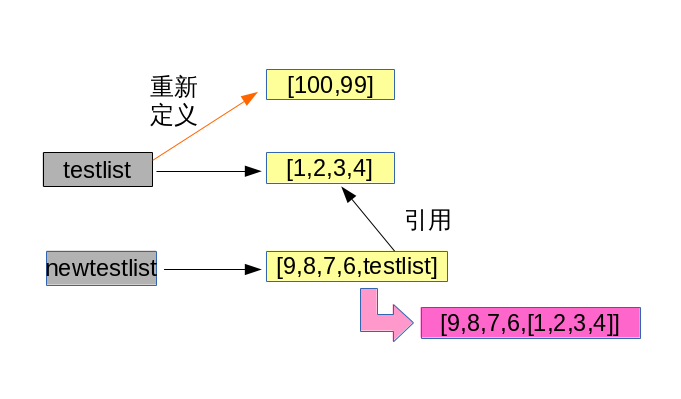

# Python+Unix和Linux系统管理指南学习2-Python的核心数据类型
<!-- TOC depthFrom:1 depthTo:6 withLinks:1 updateOnSave:1 orderedList:0 -->

- [Python+Unix和Linux系统管理指南学习2-Python的核心数据类型](#pythonunix和linux系统管理指南学习2-python的核心数据类型)
	- [Python的核心数据类型](#python的核心数据类型)
	- [列表](#列表)
		- [列表的运算](#列表的运算)
		- [列表操作](#列表操作)
		- [注意引用的问题](#注意引用的问题)
	- [元组](#元组)
	- [字典](#字典)
	- [集合](#集合)
	- [再议不可变对象](#再议不可变对象)
	- [课后习题](#课后习题)
		- [列表和字典](#列表和字典)
		- [元组](#元组)
		- [总习题](#总习题)

<!-- /TOC -->

## Python的核心数据类型


|内置对象||例子 常量/创建|
|:--|:--|:--|
|Number|数字|12,3.14,3+4j|
|String|字符串|'hello',"I'm ok"|
|List|列表|[1,[2,'three'],4]|
|Dictionaries|字典|{'food': 'spam', 'taste': 'yum'}|
|Tuple|元组|(1,'spam', 4, 'U')|
|File|文件|myfile = open('eggs', 'r')|
|Set|集合|set('abc'),{'a','b','c'}|
|其他|类型|类型、none、布尔型|
|编程单元|类型|函数、模块、类|
|与实现相关|类型|编译的代码堆栈跟踪|

前面我们学习了数字，字符串，文件三种数据类型，接下来我们将一起学习其他高级数据类型。


## 列表

Python内置的一种数据类型是列表：list。list是一种有序的集合，可以随时添加和删除其中的元素。

> 列出班里所有同学的名字，就可以用一个list表示：

```python
In [1]: classmates = ['batman','superman','green']

In [2]: classmates
Out[2]: ['batman', 'superman', 'green']
```

> 变量classmates就是一个list。用len()函数可以获得list元素的个数：

```python
In [3]: len(classmates)
Out[3]: 3
```

> 用索引来访问list中每一个位置的元素，记得索引是从0开始的：

```python
In [4]: classmates[0]
Out[4]: 'batman'

In [5]: classmates[1]
Out[5]: 'superman'

In [6]: classmates[2]
Out[6]: 'green'

In [7]: classmates[3]
\---------------------------------------------------------------------------
IndexError                                Traceback (most recent call last)
<ipython-input-7-f6229a45910c> in <module>()
\----> 1 classmates[3]

IndexError: list index out of range
```
当索引超出了范围时，Python会报一个IndexError错误，所以，要确保索引不要越界，记得最后一个元素的索引是`len(classmates) - 1`。

>> 如果要取最后一个元素，除了计算索引位置外，还可以用`-1`做索引，直接获取最后一个元素：

```python
In [8]: classmates[-1]
Out[8]: 'green'
```
>> 以此类推，可以获取倒数第2个、倒数第3个：

```python
In [10]: classmates[-1]
Out[10]: 'green'

In [11]: classmates[-3]
Out[11]: 'batman'

In [12]: classmates[-4]
\---------------------------------------------------------------------------
IndexError                                Traceback (most recent call last)
<ipython-input-12-99b9a0b8ac95> in <module>()
\----> 1 classmates[-4]

IndexError: list index out of range
```

当然，倒数第4个就越界了。

> list是一个可变的有序表，所以，可以往list中追加元素到末尾：

```python
In [13]: classmates.append('supergirl')

In [14]: classmates
Out[14]: ['batman', 'superman', 'green', 'supergirl']
```
> 也可以把元素插入到指定的位置，比如索引号为1的位置：

```python
In [15]: classmates.insert(1,'leo')

In [16]: classmates
Out[16]: ['batman', 'leo', 'superman', 'green', 'supergirl']
```

> 要删除list末尾的元素，用pop()方法：

```python
In [17]: classmates.pop()
Out[17]: 'supergirl'

In [18]: classmates
Out[18]: ['batman', 'leo', 'superman', 'green']
```

> 要删除指定位置的元素，用pop(i)方法，其中i是索引位置：

```python
In [18]: classmates
Out[18]: ['batman', 'leo', 'superman', 'green']

In [19]: classmates.pop(1)
Out[19]: 'leo'

In [20]: classmates
Out[20]: ['batman', 'superman', 'green']
```

> 要把某个元素替换成别的元素，可以直接赋值给对应的索引位置：

```python
In [21]: classmates[1] = 'oracle'

In [22]: classmates
Out[22]: ['batman', 'oracle', 'green']
```

> list里面的元素的数据类型也可以不同，比如：

```python
In [23]: L = ['apple',1,True]
```
> list元素也可以是另一个list，比如：

```python
In [24]: S = ['python',['java','shell'],'awk']

In [25]: len(S)
Out[25]: 3
```

要注意s只有3个元素，其中s[1]又是一个list，如果拆开写就更容易理解了：

```python
In [26]: T = [L,S,'and']

In [27]: T
Out[27]: [['apple', 1, True], ['python', ['java', 'shell'], 'awk'], 'and']

In [28]: T[0][0]
Out[28]: 'apple'

In [29]: L[0]
Out[29]: 'apple'
```

要拿到'apple'可以写`T[0][0]`或者`L[0]`，因此T可以看成是一个二维数组，类似的还有三维、四维……数组，不过很少用到。

> 如果一个list中一个元素也没有，就是一个空的list，它的长度为0：

```python
In [30]: L = []

In [31]: len(L)
Out[31]: 0
```

|name|set|
|:--|:--|
|新建列表|testList=[10086,'中国移动',[1,2,4,5]]|
|删除列表元素|del testList[0:4]|
|列表长度|len(testList)|
|到列表结尾|print testList[1:]|
|向列表添加元素|testList.append('i\'m new here!')|
|弹出列表的最后一个元素|testList.pop(1)|
|列表运算|numlist * 2|
|插入元素|testList[0:2] = [1,0,0,0]|
|扩展列表|testList.extend([7,8,9,10])|
|列表反转|testList.reverse()|


```python
In [16]: tl = [10086,'zgyd',[1,2,3,4]]

In [17]: len(tl)
Out[17]: 3

In [18]: print tl[1:]
['zgyd', [1, 2, 3, 4]]

In [19]: print tl[0:1]
[10086]

In [20]: print tl[0]
10086

In [21]: print tl[2]
[1, 2, 3, 4]

In [22]: print tl[4]
\---------------------------------------------------------------------------
IndexError                                Traceback (most recent call last)
<ipython-input-22-3a4496fea863> in <module>()
\----> 1 print tl[4]

IndexError: list index out of range

In [23]: print tl[0:9]
[10086, 'zgyd', [1, 2, 3, 4]]

In [25]: tl.append("I'm here!")

In [26]: tl[0:-1]
Out[26]: [10086, 'zgyd', [1, 2, 3, 4]]

In [27]: tl[1:]
Out[27]: ['zgyd', [1, 2, 3, 4], "I'm here!"]

In [28]: tl[0:-1]
Out[28]: [10086, 'zgyd', [1, 2, 3, 4]]

In [29]: tl[-1]
Out[29]: "I'm here!"

In [32]: tl.pop(1)
Out[32]: 'zgyd'
```

### 列表的运算

列表也可以进行加和乘。

```python
In [33]: numlist = [1,2,3,4]

In [34]: print numlist
[1, 2, 3, 4]

In [35]: print numlist * 2
[1, 2, 3, 4, 1, 2, 3, 4]

In [36]: alist = ['a','b','c']

In [37]: print numlist + alist
[1, 2, 3, 4, 'a', 'b', 'c']
```

上面进行了列表的乘法,注意并不是每个元素乘以二,而是整个列表被重复
了两次,重新接合成一个新的列表。


### 列表操作

```python
In [41]: testlist=[]

In [42]: testlist[0:2]=[1,0,0]

In [43]: print testlist
[1, 0, 0]

In [44]: testlist.append(u'菜鸟')

In [45]: print testlist
[1, 0, 0, u'\u83dc\u9e1f']

In [46]: testlist.sort()

In [47]: print testlist.sort()
None

In [48]: testlist.extend([7,8,9,10])

In [49]: print testlist
[0, 0, 1, u'\u83dc\u9e1f', 7, 8, 9, 10]

In [50]: testlist.reverse()

In [51]: print testlist
[10, 9, 8, 7, u'\u83dc\u9e1f', 1, 0, 0]

In [52]: testlist.pop(0)
Out[52]: 10

In [53]: testlist.pop(1)
Out[53]: 8

In [54]: del testlist[0:4]

In [55]: testlist
Out[55]: [0, 0]
```

重点:在 list 上调用 sort 之类的函数会造成 list 本身被改变,这个 immutable
的变量是不一样的。一定不能重新赋值,例如:
testList = testList.sort()
将会导致 testList 失去对原对象的引用。

### 注意引用的问题

用一个例子程序来说明这个问题:


引用,而非拷贝

* 引用 testList;如果 testList 被改变了,就会影响 newTestList;
* 但是如果 testList 被重新定义了;就不会影响 newTestList

```python
In [66]: testlist=[1,2,3,4]

In [67]: newtestlist=[9,8,7,6,testlist]

In [68]: newtestlist
Out[68]: [9, 8, 7, 6, [1, 2, 3, 4]]

In [69]: testlist.append(5)

In [70]: newtestlist
Out[70]: [9, 8, 7, 6, [1, 2, 3, 4, 5]]

In [71]: testlist=[100,99]

In [72]: testlist
Out[72]: [100, 99]

In [73]: newtestlist
Out[73]: [9, 8, 7, 6, [1, 2, 3, 4, 5]]
```



> 课堂练习
```python
#!/usr/bin/env python
#-*- coding: utf-8 -*-
shoplist = ['apple', 'mango', 'carrot', 'banana']
print('我有{0} 个东西要买。'.format(len(shoplist)))
print('要买的东西是：')
for item in shoplist:
	print('{0} '.format(item))

print('我还需要买rice')
shoplist.append('rice')
print('我现在的购物列表为：{0}'.format(shoplist))

print('接下来我要将购物列表排序')
shoplist.sort()
print('排序后的购物列表为：{0}'.format(shoplist))

print('第一个我要买的东西是：{0}'.format(shoplist[0]))
olditem = shoplist[0]
del shoplist[0]
print('我已经买了{0}'.format(olditem))
print('我现在的购物列表为：{0}'.format(shoplist))
```
执行结果：
```python
我有4 个东西要买。
要买的东西是：
apple
mango
carrot
banana
我还需要买rice
我现在的购物列表为：['apple', 'mango', 'carrot', 'banana', 'rice']
接下来我要将购物列表排序
排序后的购物列表为：['apple', 'banana', 'carrot', 'mango', 'rice']
第一个我要买的东西是：apple
我已经买了apple
我现在的购物列表为：['banana', 'carrot', 'mango', 'rice']
```
## 元组

另一种有序列表叫元组：tuple。tuple和list非常类似，但是tuple一旦初始化就不能修改.

|name|set|
|:--|:--|
|新建元组|classmates = ('Michael', 'Bob', 'Tracy')|
|删除元组|del classmates|

> 比如同样是列出同学的名字：

```python
In [1]: classmates = ('Michael', 'Bob', 'Tracy')

In [2]: classmates
Out[2]: ('Michael', 'Bob', 'Tracy')
```

现在，classmates这个tuple不能变了，它也没有`append()`，`insert()`这样的方法。其他获取元素的方法和list是一样的，你可以正常地使用`classmates[0]`，`classmates[-1]`，但不能赋值成另外的元素。

不可变的tuple有什么意义？因为tuple不可变，所以代码更安全。如果可能，能用tuple代替list就尽量用tuple。

> tuple的陷阱：当你定义一个tuple时，在定义的时候，tuple的元素就必须被确定下来，比如：

```python
In [3]: t = (1,2)

In [4]: t
Out[4]: (1, 2)
```

> 如果要定义一个空的tuple，可以写成()：

```python
In [5]: t = ()

In [6]: t
Out[6]: ()
```

> 但是，要定义一个只有1个元素的tuple，如果你这么定义：

```python
In [7]: t = (1)

In [8]: t
Out[8]: 1
```

定义的不是tuple，是1这个数！这是因为括号()既可以表示tuple，又可以表示数学公式中的小括号，这就产生了歧义，因此，Python规定，这种情况下，按小括号进行计算，计算结果自然是1。

> 所以，只有1个元素的tuple定义时必须加一个逗号,，来消除歧义：

```python
In [9]: t = (1,)

In [10]: t
Out[10]: (1,)
```

Python在显示只有1个元素的tuple时，也会加一个逗号,，以免你误解成数学计算意义上的括号。

> 最后来看一个“可变的”tuple：

```python
In [11]: t = ('a','b',['A','B'])

In [12]: t[2][0]
Out[12]: 'A'

In [14]: t[2][1]
Out[14]: 'B'
In [15]: t[2][0] = 'X'

In [16]: t[2][1] = 'Y'

In [17]: t
Out[17]: ('a', 'b', ['X', 'Y'])
```

这个tuple定义的时候有3个元素，分别是'a'，'b'和一个list。不是说tuple一旦定义后就不可变了吗？怎么后来又变了？

别急，我们先看看定义的时候tuple包含的3个元素：


当我们把list的元素'A'和'B'修改为'X'和'Y'后，tuple变为：


表面上看，tuple的元素确实变了，但其实变的不是tuple的元素，而是list的元素。tuple一开始指向的list并没有改成别的list，所以，tuple所谓的“不变”是说，tuple的每个元素，指向永远不变。即指向'a'，就不能改成指向'b'，指向一个list，就不能改成指向其他对象，但指向的这个list本身是可变的！

理解了“指向不变”后，要创建一个内容也不变的tuple怎么做？那就必须保证tuple的每一个元素本身也不能变。

> 小结
>> list和tuple是Python内置的有序集合，一个可变，一个不可变。根据需要来选择使用它们。

---
## 字典

|name|set|
|:--|:--|
|新建字典|testDict={{ 'time':'时间','machine':'机器','time machine':'时间机器'}}|
|输出字典key的value|testDict['time']|
|删除字典or key|del testDict['a']|
|删除key|d.pop('Bob')|

Python内置了字典：dict的支持，dict全称dictionary，在其他语言中也称为map，使用键-值（key-value）存储，具有极快的查找速度。

> 举个例子，假设要根据同学的名字查找对应的成绩，如果用list实现，需要两个list：

* `names = ['Michael', 'Bob', 'Tracy']`
* `scores = [95, 75, 85]`

给定一个名字，要查找对应的成绩，就先要在names中找到对应的位置，再从scores取出对应的成绩，list越长，耗时越长。

如果用dict实现，只需要一个“名字”-“成绩”的对照表，直接根据名字查找成绩，无论这个表有多大，查找速度都不会变慢。用Python写一个dict如下：

```python
In [18]: d = {'Michael': 95, 'Bob': 75, 'Tracy': 85}

Out[20]: 95
```

为什么dict查找速度这么快？因为dict的实现原理和查字典是一样的。假设字典包含了1万个汉字，我们要查某一个字，一个办法是把字典从第一页往后翻，直到找到我们想要的字为止，这种方法就是在list中查找元素的方法，list越大，查找越慢。

第二种方法是先在字典的索引表里（比如部首表）查这个字对应的页码，然后直接翻到该页，找到这个字，无论找哪个字，这种查找速度都非常快，不会随着字典大小的增加而变慢。

dict就是第二种实现方式，给定一个名字，比如'Michael'，dict在内部就可以直接计算出Michael对应的存放成绩的“页码”，也就是95这个数字存放的内存地址，直接取出来，所以速度非常快。

你可以猜到，这种key-value存储方式，在放进去的时候，必须根据key算出value的存放位置，这样，取的时候才能根据key直接拿到value。

> 把数据放入dict的方法，除了初始化时指定外，还可以通过key放入：

```python
In [21]: d['Adam'] = 67

In [22]: d['Adam']
Out[22]: 67
```

> 由于一个key只能对应一个value，所以，多次对一个key放入value，后面的值会把前面的值冲掉：

```python
In [23]: d['Jack'] = 90

In [24]: d['Jack']
Out[24]: 90

In [25]: d['Jack'] = 88

In [26]: d['Jack']
Out[26]: 88
```

> 如果key不存在，dict就会报错：

```python
In [27]: d['Thomas']
\---------------------------------------------------------------------------
KeyError                                  Traceback (most recent call last)
<ipython-input-27-d933a34735ff> in <module>()
\----> 1 d['Thomas']

KeyError: 'Thomas'
```

> 要避免key不存在的错误，有两种办法，一是通过in判断key是否存在：

```python
In [28]: 'Thomas' in d
Out[28]: False
```

> 二是通过dict提供的get方法，如果key不存在，可以返回None，或者自己指定的value：

```python
In [29]: d.get('Thomas')

In [30]: d.get('Thomas',-1)
Out[30]: -1
```

注意：返回None的时候Python的交互式命令行不显示结果。

> 要删除一个key，用pop(key)方法，对应的value也会从dict中删除：

```python
In [31]: d
Out[31]: {'Adam': 67, 'Bob': 75, 'Jack': 88, 'Michael': 95, 'Tracy': 85}

In [32]: d.pop('Bob')
Out[32]: 75

In [33]: d
Out[33]: {'Adam': 67, 'Jack': 88, 'Michael': 95, 'Tracy': 85}
```

请务必注意，dict内部存放的顺序和key放入的顺序是没有关系的。

和list比较，dict有以下几个特点：

*    查找和插入的速度极快，不会随着key的增加而增加；
*    需要占用大量的内存，内存浪费多。

而list相反：

*    查找和插入的时间随着元素的增加而增加；
*    占用空间小，浪费内存很少。

所以，dict是用空间来换取时间的一种方法。

dict可以用在需要高速查找的很多地方，在Python代码中几乎无处不在，正确使用dict非常重要，需要牢记的第一条就是dict的key必须是不可变对象。

这是因为dict根据key来计算value的存储位置，如果每次计算相同的key得出的结果不同，那dict内部就完全混乱了。这个通过key计算位置的算法称为哈希算法（Hash）。

要保证hash的正确性，作为key的对象就不能变。在Python中，字符串、整数等都是不可变的，因此，可以放心地作为key。而list是可变的，就不能作为key：

```python
In [34]: key = [1, 2, 3]

In [35]: d[key] = 'a list'

---------------------------------------------------------------------------
TypeError                                 Traceback (most recent call last)
<ipython-input-35-24a3c62d5559> in <module>()
----> 1 d[key] = 'a list'

TypeError: unhashable type: 'list'

```

---
## 集合

|name|set|
|:--|:--|
|新建集合|s = set([1, 2, 3])|
|添加元素|s.add(key)|
|删除元素|s.remove(key)|
|交集、并集|"&\|"|

set和dict类似，也是一组key的集合，但不存储value。由于key不能重复，所以，在set中，没有重复的key。

> 要创建一个set，需要提供一个list作为输入集合：

```python
In [36]: s = set([1, 2, 3])

In [37]: s
Out[37]: set([1, 2, 3])
```

注意，传入的参数[1, 2, 3]是一个list，而显示的set([1, 2, 3])只是告诉你这个set内部有1，2，3这3个元素，显示的[]不表示这是一个list。

> 重复元素在set中自动被过滤：

```python
In [38]: s = set([1, 1, 2, 2, 3, 3])

In [39]: s
Out[39]: set([1, 2, 3])
```

> 通过add(key)方法可以添加元素到set中，可以重复添加，但不会有效果：

```python
In [40]: s.add(4)

In [41]: s
Out[41]: set([1, 2, 3, 4])
```

> 通过remove(key)方法可以删除元素：

```python
In [42]: s.remove(4)

In [43]: s
Out[43]: set([1, 2, 3])
```

> set可以看成数学意义上的无序和无重复元素的集合，因此，两个set可以做数学意义上的交集、并集等操作：

```python
In [44]: s1 = set([1,2,3])

In [45]: s2 = set([2,3,4])

In [46]: s1 & s2
Out[46]: set([2, 3])

In [47]: s1 | s2
Out[47]: set([1, 2, 3, 4])
```

set和dict的唯一区别仅在于没有存储对应的value，但是，set的原理和dict一样，所以，同样不可以放入可变对象，因为无法判断两个可变对象是否相等，也就无法保证set内部“不会有重复元素”。试试把list放入set，看看是否会报错。


## 再议不可变对象

上面我们讲了，str是不变对象，而list是可变对象。

* 对于可变对象，比如list，对list进行操作，list内部的内容是会变化的
* 虽然字符串有个replace()方法，也确实变出了'Abc'，但变量a最后仍是'abc'，应该怎么理解呢？
* 要始终牢记的是，a是变量，而'abc'才是字符串对象！有些时候，我们经常说，对象a的内容是'abc'，但其实是指，a本身是一个变量，它指向的对象的内容才是'abc'
* 当我们调用a.replace('a', 'A')时，实际上调用方法replace是作用在字符串对象'abc'上的，而这个方法虽然名字叫replace，但却没有改变字符串'abc'的内容。相反，replace方法创建了一个新字符串'Abc'并返回，如果我们用变量b指向该新字符串，就容易理解了，变量a仍指向原有的字符串'abc'，但变量b却指向新字符串'Abc'了：


所以，对于不变对象来说，调用对象自身的任意方法，也不会改变该对象自身的内容。相反，这些方法会创建新的对象并返回，这样，就保证了不可变对象本身永远是不可变的。

> 小结

* 使用key-value存储结构的dict在Python中非常有用，选择不可变对象作为key很重要，最常用的key是字符串。
* tuple虽然是不变对象，但试试把(1, 2, 3)和(1, [2, 3])放入dict或set中，并解释结果。

## 课后习题

### 列表和字典

> python完成

1. 举出两种方法来创建内含五个整数领的列表
2. 举出两种方法来创建一个字典，由两个健'a'和'b'，而且每个健相关联的值都是0
3. 举出四种在原处修改列表对象的运算
4. 举出四种在原处修改字典对象的运算

> 习题解答

1. `[0,0,0,0]` 或 `[0] * 5`
2. `{'a':0,'b':0}` 或 `D={};D['a']=0;D['b']=0 `
3. `append()`增加元素；`extend()`增长列表；`sort()`排序列表；`reverse()`翻转
4. 字典的修改主要是赋值新的见或已存在的健。`D['c']=0` `del D['a']` `D.pop(key)`

### 元组

> python完成

1. 你怎么确定元组多大？
2. 写一个表达式，修改元组中的第一个元素。在此过程中，`(4，5，6)`应该变为`(1,5,6)`

> 习题解答

1. `len(T)`
2. 无法修改元组，但可以通过表达式重新赋值:`T=(4,5,6);T=(1,)+T[1:]` ；可以将元组转变为列表，修改后的列表转化为元组:`T=(4,5,6);L=list(T);L[0]=1;T=tuple(L)`

### 总习题

1. 基础——打开ipython交互式模式解释器，输入以下表达式，然后试着说明每种情况所产生的结果：
```python
2 ** 16
2 / 5, 2 / 5.0
"spam" + "eggs"
S = "ham"
"eggs " + S
S * 5
S[:0]
"green %s and %s" % ("eggs", S)
'green {0} and {1}'.format('eggs', S)
('x',)[0]
('x', 'y')[1]
L = [1,2,3] + [4,5,6]
L, L[:], L[:0], L[−2], L[−2:]
([1,2,3] + [4,5,6])[2:4]
[L[2], L[3]]
L.reverse(); L
L.sort(); L
L.index(4)
{'a':1, 'b':2}['b']
D = {'x':1, 'y':2, 'z':3}
D['w'] = 0
D['x'] + D['w']
D[(1,2,3)] = 4
list(D.keys()), list(D.values()), (1,2,3) in D
[[]], ["",[],(),{},None]
```

2. 索引和分片运算——ipython交互模式下，定义一个名为L的列表，内含四个字符串或数字
（例如，`L=[0,1,2,3]`）。然后，实验一些边界情况，你可能不会在真实的程序种看到这些例子，但是它们
用来促使你思考底层的模型，并且其中一些可能在较少的人为编写的形式种有用：

```python
L[4]
L[-1000:100]
L[3:1]
L[3:1]=['?']
```
- 索引值超过边界，会如何？
- 分片运算超出边界会如何？
- 反向抽取序列，当较低边界值大于高边界值会如何？
- 试着赋值到上题分片，看看此值将置于何处？
- 你觉得这和分片超出边界是相同现象吗？

3. 索引运算、分片运算以及del——定义另一个列表L，有四个元素，然后赋值给一个空列表给器偏移值
之一（例如，`L[2]=[]`），发生什么事？然后，赋值空列表个分片`L[2:3]=[]`。现在，发生了什么？
回想以下，分片赋值运算删除分片，并将新值插入分片曾经的地方。

del会删除偏移量、健、属性以及名称。将其用在列表上来删除一个元素`del L[0]`。如果你删除整个分片，
会发生什么`del L[1:]` ？当你赋值非序列给分片时，会发生什么变化`L[1:2]=1`？

4. 元祖赋值运算——输入下面几行：`X='spam';Y='eggs';X,Y=Y,X`，你觉得X和Y会发生什么变化？

5. 文件——写一个脚本，创建名为myfile.txt的新的输出文件，把字符串`"Hello file word!"`写入。
然后写另一个脚本，开启myfile.txt，把其内容取出来并将其打印出来。

从系统命令行执行你的两个脚本。

-	新文件是否出现在执行脚本所在目录？
-	如果对开启的文件名新增不同的目录路径，有会怎样？

```python
#!/usr/bin/env python

S="Hello file word!\n"
with open('myfile.txt','w') as f:
	f.write(S)
print open('myfile.txt').read()
```

总结
```
数据类型之间的转换
数字---字符串	'%d'%num
字符串---数字	str.atoi()
字符串---list	import string string.split()
list---tuple	tuple(list)
tuple---list	list(tuple)
list---字符串	'str'.join(list)
dict---》list	dic.items()
文件---》list	open('file').readlines()
文件---》string	open('file').read()
```
